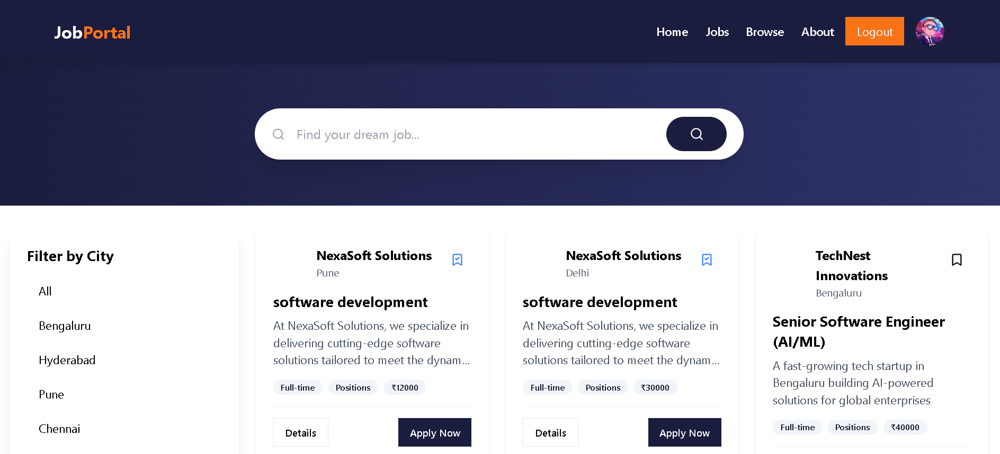

# Job Portal

A full-stack Job Portal application with separate backend and frontend projects.

## Project Structure

```
backend/
  app.js
  package.json
  server.js
  automation/
  config/
  controllers/
  database/
  middleware/
  models/
  routes/
  utils/
frontend/
  .gitignore
  components.json
  index.html
  package.json
  public/
  src/
  ...
Interface/
  Home.png
  jobs.png
```

## Backend

- **Tech Stack:** Node.js, Express, MongoDB, Mongoose
- **Features:** User authentication, job posting, application management, admin panel, scheduled jobs, file uploads (Cloudinary), RESTful API.

### Setup

1. Install dependencies:
   ```sh
   cd backend
   npm install
   ```
2. Create `config/config.env` (see `.gitignore` for path).
3. Start the server:
   ```sh
   npm run dev
   ```

### API Routes

| Method | Endpoint             | Description                   |
| ------ | -------------------- | ----------------------------- |
| POST   | `/api/auth/register` | Register a new user           |
| POST   | `/api/auth/login`    | Login user                    |
| GET    | `/api/jobs`          | Get all jobs                  |
| POST   | `/api/jobs`          | Create a new job (admin only) |
| GET    | `/api/jobs/:id`      | Get job by ID                 |
| PUT    | `/api/jobs/:id`      | Update job (admin only)       |
| DELETE | `/api/jobs/:id`      | Delete job (admin only)       |
| POST   | `/api/apply/:jobId`  | Apply to a job                |
| GET    | `/api/applications`  | Get user applications         |
| GET    | `/api/admin/users`   | Get all users (admin only)    |
| ...    | ...                  | ...                           |

#### Example: Register a New User

**Request**

```http
POST /api/auth/register
Content-Type: application/json

{
  "name": "John Doe",
  "email": "john@example.com",
  "password": "yourpassword"
}
```

**Response**

```json
{
  "success": true,
  "user": {
    "_id": "609c1b2e8f1b2c0015b2c123",
    "name": "John Doe",
    "email": "john@example.com",
    "role": "user"
  },
  "token": "jwt_token_here"
}
```

## Frontend

- **Tech Stack:** React, Redux Toolkit, Vite, Tailwind CSS, Framer Motion
- **Features:** User registration/login, job browsing, application submission, profile management, admin dashboard.

### Setup

1. Install dependencies:
   ```sh
   cd frontend
   npm install
   ```
2. Start the development server:
   ```sh
   npm run dev
   ```

## Interface

Screenshots and UI assets are in the `Interface/` folder.

Example interface:




## License

This project is for educational purposes.
